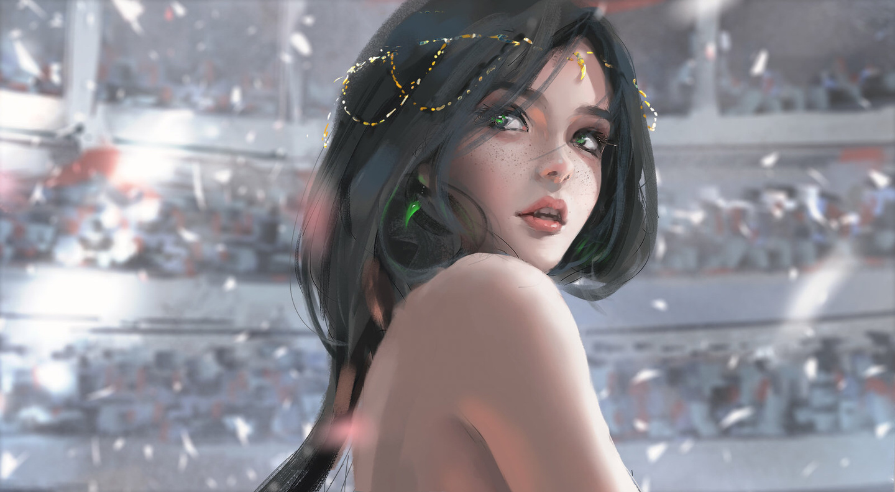

<!-- _coverpage.md -->

# 欢迎来到蓝蓝的博客

- 公众号：暖蓝笔记
- B站:   暖蓝笔记

 

    👀 本站总访问量： 次

    | 🚴‍♂️ 本站总访客数： 人

 

- 蓝蓝博客，看了就上岸的博客。

<!-- () 后面是点击后的链接(自定义作者名) -->

<!-- () 后面是点击后的链接(自定义版本号) -->

[Gitee](<https://gitee.com/LDeCunZai/lanlan-interview>)
[Github](<>)
[开始阅读](README.md)

 
<!-- 背景图片 -->

 
