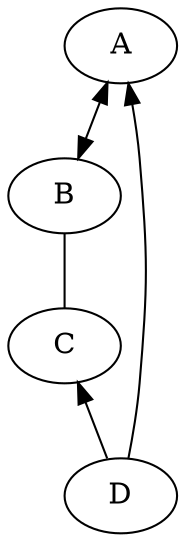

# DOCSIFY 构建文档网站之定制功能（全网最全）

[编程学习](https://www.ngui.cc/csdn0.html) · 2020/7/1 20:35:54 · 541 次浏览

- 作者： wugenqiang
- 学习笔记：https://notebook.js.org/
- 微信公众号：码客 E 分享（ID：enjoytoshare）

> 文档后续更新地址：DOCSIFY 构建文档网站

## 4 定制功能


### 文章目录

- - 4 定制功能

  - - 4.1 支持 DOT 语言作图

    - 4.2 支持 LaTex 数学公式

    - 4.3 支持 PDF 页面展示

    - 4.4 支持回到顶部

    - 4.5 点击页面出现爱心

    - 4.6 定制评论功能

    - - 4.6.1 来必力评论
      - 4.6.2 Gitalk 评论
      - 4.6.3 Disqus 评论

    - 4.7 复制文章弹窗提示

    - 4.8 添加网站运行时间

    - 4.9 美化提示样式

    - 4.10 实现旧域名跳转

    - 4.11 Social Share 分享插件

    - 4.12 右下角添加 live2d

    - 4.13 访问量统计

  - 


------

### 4.1 支持 DOT 语言作图

> DOT 语言是贝尔实验室开发的用于作图的脚本语言，最初在桌面端程序 GRAPHVIZ 中支持。后来有人开发了 VIZ.JS 使得浏览器端也能支持 DOT 语言作图的渲染。我们的目的如下：当 MARKDOWN 渲染器识别到一处语言名为 DOT 代码块时，就调用 VIZ.JS 渲染代码块中的语句，使它们成为 DOT 语言定义的矢量图。

> 具体操作如下：（以下所有操作都在 DOCSIFY 项目的 INDEX.HTML 文件中进行）

- （1）首先，引入 Viz.js 文件，只要在 head 中添加一条语句就行：

```js
  <script src="https://cdn.jsdelivr.net/npm/viz.js@1.8.0/viz.js"></script>
```

- （2）添加如下部分：

```js
<script>
    window.$docsify = {
      markdown: {
        renderer: {
          code: function(code, lang) {
            if (lang === "dot") {
              return (
                      '<div class="viz">'+ Viz(code, "SVG")+'</div>'
              );
            }
            return this.origin.code.apply(this, arguments);
          }
        }
      }
    }
  </script>
```

> 下面看看具体实现：

- 操作：

````

````

- 效果图：


### 4.2 支持 LaTex 数学公式

> LATEX 是大门鼎鼎的文档排版软件，它对于数学公式的支持非常好。和 DOT 语言类似，一开始也是只有桌面端程序支持，但是后来同样有人开发了各种各样的 .JS 来在浏览器端进行支持。

> 具体操作如下：（以下所有操作都在 DOCSIFY 项目的 INDEX.HTML 文件中进行）

- （1）引入 docsify-katex.js，head 中添加：

```js
<!-- CDN files for docsify-katex -->
<script src="//cdn.jsdelivr.net/npm/docsify-katex@latest/dist/docsify-katex.js"></script>
<!-- or <script src="//cdn.jsdelivr.net/gh/upupming/docsify-katex@latest/dist/docsify-katex.js"></script> -->
<link rel="stylesheet" href="//cdn.jsdelivr.net/npm/katex@latest/dist/katex.min.css"/>
```

> 下面看看具体实现：

- 操作：

```
$$
\left[
\begin{matrix}
 1      & 2      & \cdots & 4      \\
 7      & 6      & \cdots & 5      \\
 \vdots & \vdots & \ddots & \vdots \\
 8      & 9      & \cdots & 0      \\
\end{matrix}
\right]
$$
```

- 效果图：

\left[ \begin{matrix} 1 & 2 & \cdots & 4 \\ 7 & 6 & \cdots & 5 \\ \vdots & \vdots & \ddots & \vdots \\ 8 & 9 & \cdots & 0 \\ \end{matrix} \right]⎣⎢⎢⎢⎡17⋮826⋮9⋯⋯⋱⋯45⋮0⎦⎥⎥⎥⎤

> 更多 LATEX 矩阵样式请参考 使用 LATEX 写矩阵

### 4.3 支持 PDF 页面展示

- （1）在 index.html 中添加插件：

```js
<!-- PDFObject.js is a required dependency of this plugin -->
<script src="//cdnjs.cloudflare.com/ajax/libs/pdfobject/2.1.1/pdfobject.min.js"></script> 
<!-- docsify-pdf-embed.js  -->
<script src="//unpkg.com/docsify-pdf-embed-plugin/src/docsify-pdf-embed.js"></script>
```

- （2）在 index.html 中添加代码：

```js
markdown: {
        renderer: {
          code: function(code, lang, base=null) {

            /* if (lang === "dot") {
              return (
                      '<div class="viz">'+ Viz(code, "SVG")+'</div>'
              );
            } */

            var pdf_renderer = function(code, lang, verify) {
              function unique_id_generator(){
                function rand_gen(){
                  return Math.floor((Math.random()+1) * 65536).toString(16).substring(1);
                }
                return rand_gen() + rand_gen() + '-' + rand_gen() + '-' + rand_gen() + '-' + rand_gen() + '-' + rand_gen() + rand_gen() + rand_gen();
              }
              if(lang && !lang.localeCompare('pdf', 'en', {sensitivity: 'base'})){
                if(verify){
                  return true;
                }else{
                  var divId = "markdown_code_pdf_container_" + unique_id_generator().toString();
                  var container_list = new Array();
                  if(localStorage.getItem('pdf_container_list')){
                    container_list = JSON.parse(localStorage.getItem('pdf_container_list'));
                  }
                  container_list.push({"pdf_location": code, "div_id": divId});
                  localStorage.setItem('pdf_container_list', JSON.stringify(container_list));
                  return (
                          '<div style="margin-top:'+ PDF_MARGIN_TOP +'; margin-bottom:'+ PDF_MARGIN_BOTTOM +';" id="'+ divId +'">'
                          + '<a href="'+ code + '"> Link </a> to ' + code +
                          '</div>'
                  );
                }
              }
              return false;
            }
            if(pdf_renderer(code, lang, true)){
              return pdf_renderer(code, lang, false);
            }
            //return this.origin.code.apply(this, arguments);
            return (base ? base : this.origin.code.apply(this, arguments));
          }
        }
      }
```

- （3）使用命令：

````
```pdf
path-to-the-pdf-file,,,example: https://wugenqiang.gitee.io/file-storage/pdf.js/web/viewer.html?file=../../%E6%B7%B1%E5%BA%A6%E5%AD%A6%E4%B9%A0/%E6%B7%B1%E5%BA%A6%E5%AD%A6%E4%B9%A0%E5%9F%BA%E7%A1%80%E6%95%99%E7%A8%8B.pdf
```
````

> 结果展示：

```pdf
https://wugenqiang.gitee.io/file-storage/pdf.js/web/viewer.html?file=../../%E6%B7%B1%E5%BA%A6%E5%AD%A6%E4%B9%A0/%E6%B7%B1%E5%BA%A6%E5%AD%A6%E4%B9%A0%E5%9F%BA%E7%A1%80%E6%95%99%E7%A8%8B.pdf
```

### 4.4 支持回到顶部

> 方法：通过 JQUERY 定义插件 JQUERY GOUP 实现点击回到顶部功能。

- 效果图如下：


> 操作如下：

- （1）引用 jquery 库和 jquery.goup.js 到 index.html

```js
  <script src="https://wugenqiang.github.io/CS-Notes/plugin/jquery.js"></script>
  <script src="https://wugenqiang.github.io/CS-Notes/plugin/jquery.goup.js"></script>
```

- 在调用下插件：

```js
<script type="text/javascript">
    $(document).ready(function () {
      $.goup({
        trigger: 100,
        bottomOffset: 32,
        locationOffset: 32,
        title: 'TOP',
        titleAsText: true
      });
    });
  </script>
```

### 4.5 点击页面出现爱心

在 index.html 中复制下面代码：

```js
<!-- mouse click -->
<script src="//cdn.jsdelivr.net/gh/jerryc127/butterfly_cdn@2.1.0/js/click_heart.js"></script>
```

### 4.6 定制评论功能

#### 4.6.1 来必力评论

在 index.html 中 `window.$docsify`中添加代码：

```html
plugins: [
        /*来必力评论*/
        function (hook, vm) {
          // load livere
          hook.beforeEach(function(content) {
            var comment = "<div id='lv-container' data-id='city' data-uid='MTAyMC80MzA4MC8xOTYyNg=='></div>\n\n----\n"
            return content + comment;
          });

          hook.doneEach(function() {
            (function(d, s) {
              var j, e = d.getElementsByTagName(s)[0];
              if (typeof LivereTower === 'function') { return; }
              j = d.createElement(s);
              j.src = 'https://cdn-city.livere.com/js/embed.dist.js';
              j.async = true;
              e.parentNode.insertBefore(j, e);
            })(document, 'script');
          });
        },
      ]
```

效果图：


#### 4.6.2 Gitalk 评论

- （1）申请 Gitalk

申请网址：https://github.com/settings/applications/new

要是觉得自己填的不好或者填错了，没关系，这个后面是可以改的


注册完毕之后，会进入这个界面：


在这里，你就能看到 `clientID` 和 `clientSecret` 啦，页面不要关闭，先记录一下这两个值，下面有用。

- （2）修改 index.html

添加下面代码：(以我的举例，适当修改)

```html
<!-- Gitalk 评论系统 -->
<link rel="stylesheet" href="https://wugenqiang.gitee.io/notebook/plugin/gitalk.css">
<!-- Gitalk 评论系统 -->
<script src="https://wugenqiang.gitee.io/notebook/plugin/gitalk.js"></script>
<script src="https://wugenqiang.gitee.io/notebook/plugin/gitalk.min.js"></script>
<script src="https://wugenqiang.gitee.io/notebook/plugin/md5.min.js"></script>
<script>
  // title_id需要初始化
  window.title_id = window.location.hash.match(/#(.*?)([?]|$)/) ? window.location.hash.match(/#(.*?)([?]|$)/)[1] : '/';
  const gitalk = new Gitalk({
    clientID: 'b631e65d2e0ceb90837c',
    clientSecret: 'ff821461c12519b13271850829c32e5842cf9619',
    repo: 'NoteBook',
    owner: 'wugenqiang',
    admin: ['wugenqiang'],
    title: decodeURI(window.title_id),
    distractionFreeMode: false,	// 是否添加全屏遮罩
    id: md5(window.location.hash),	// 页面的唯一标识，gitalk 会根据这个标识自动创建的issue的标签,我们使用页面的相对路径作为标识
    enableHotKey: true,	// 提交评论快捷键(cmd/ctrl + enter)
  })
  // 监听URL中hash的变化，如果发现换了一个MD文件，那么刷新页面，解决整个网站使用一个gitalk评论issues的问题。
  window.onhashchange = function (event) {
    if (event.newURL.split('?')[0] !== event.oldURL.split('?')[0]) {
      location.reload()
    }
  }
</script>
```

- （3）效果图：


#### 4.6.3 Disqus 评论

在 index.html 中添加：

```js
<script>
  window.$docsify = {
    disqus: 'shortname'
  }
</script>
<script src="//cdn.jsdelivr.net/npm/docsify/lib/plugins/disqus.min.js"></script>
```

效果图：


### 4.7 复制文章弹窗提示

在 index.html 中写入：

```js
<!-- alert 样式 -->
<link rel="stylesheet" href="https://cdn.bootcss.com/sweetalert/1.1.3/sweetalert.min.css" type='text/css' media='all' />

<!-- 复制提醒 -->
<script src="https://cdn.bootcss.com/sweetalert/1.1.3/sweetalert.min.js"></script>
<script>
  document.body.oncopy = function () {
    swal("复制成功 🎉",
            "若要转载或引用请务必保留原文链接，并申明来源。如果你觉得本仓库不错，那就来 GitHub 给个 Star 吧 😊   - by 吴跟强",
            "success"); };
</script>
```

效果图：


### 4.8 添加网站运行时间

在 index.html 页面中写入：

```html
<!-- 访问量统计 -->
<script async src="//busuanzi.ibruce.info/busuanzi/2.3/busuanzi.pure.mini.js"></script>

<!-- 运行时间统计 -->
<script language=javascript>
  function siteTime() {
    window.setTimeout("siteTime()", 1000);
    var seconds = 1000;
    var minutes = seconds * 60;
    var hours = minutes * 60;
    var days = hours * 24;
    var years = days * 365;
    var today = new Date();
    var todayYear = today.getFullYear();
    var todayMonth = today.getMonth() + 1;
    var todayDate = today.getDate();
    var todayHour = today.getHours();
    var todayMinute = today.getMinutes();
    var todaySecond = today.getSeconds();
    /* Date.UTC() -- 返回date对象距世界标准时间(UTC)1970年1月1日午夜之间的毫秒数(时间戳)
    year - 作为date对象的年份，为4位年份值
    month - 0-11之间的整数，做为date对象的月份
    day - 1-31之间的整数，做为date对象的天数
    hours - 0(午夜24点)-23之间的整数，做为date对象的小时数
    minutes - 0-59之间的整数，做为date对象的分钟数
    seconds - 0-59之间的整数，做为date对象的秒数
    microseconds - 0-999之间的整数，做为date对象的毫秒数 */
    var t1 = Date.UTC(2020, 02, 10, 00, 00, 00); //北京时间2020-02-10 00:00:00
    var t2 = Date.UTC(todayYear, todayMonth, todayDate, todayHour, todayMinute, todaySecond);
    var diff = t2 - t1;
    var diffYears = Math.floor(diff / years);
    var diffDays = Math.floor((diff / days) - diffYears * 365);
    var diffHours = Math.floor((diff - (diffYears * 365 + diffDays) * days) / hours);
    var diffMinutes = Math.floor((diff - (diffYears * 365 + diffDays) * days - diffHours * hours) / minutes);
    var diffSeconds = Math.floor((diff - (diffYears * 365 + diffDays) * days - diffHours * hours - diffMinutes * minutes) / seconds);
    document.getElementById("sitetime").innerHTML = " 本网站已运行 " + diffYears + " 年 " + diffDays + " 天 " + diffHours + " 小时 " + diffMinutes + " 分钟 " + diffSeconds + " 秒 ";
  }
  siteTime();
</script>
```

然后嵌入代码：

```html
<span id="sitetime"></span>
```

如果和我一样嵌入在页脚部分，可以如图设置：


效果图如下：


### 4.9 美化提示样式

Docsify-alerts

效果图：


（1）在 index.html 页面中写入：

```js
<!-- Latest -->
<script src="https://unpkg.com/docsify-plugin-flexible-alerts"></script>
```

默认情况下，样式 `flat` 和 `callout`（默认值：`callout`）和类型 `NOTE`，`TIP`，`WARNING` 和 `DANGER` 支持。在类型和标题之间使用以下映射：

| Type    | Heading   |
| :------ | :-------- |
| NOTE    | Note      |
| TIP     | Tip       |
| WARNING | Warning   |
| DANGER  | Attention |

如果想效果是这样：


可以在 index.html 页面中添加：

```js
<script>
  window.$docsify = {
    'flexible-alerts': {
      style: 'flat'
    }
  };
</script>
```

本人习惯这样的格式，所以选择默认：


（3）使用示例：

- 示例一：

```
> [!NOTE]
> An alert of type 'note' using global style 'callout'.
```

效果：

> [!NOTE]
> AN ALERT OF TYPE ‘NOTE’ USING GLOBAL STYLE ‘CALLOUT’.

- 示例二：

```
> [!TIP]
> An alert of type 'tip' using global style 'callout'.
```

效果：

> [!TIP]
> AN ALERT OF TYPE ‘TIP’ USING GLOBAL STYLE ‘CALLOUT’.

- 示例三：

```
> [!WARNING]
> An alert of type 'warning' using global style 'callout'.
```

效果：

> [!WARNING]
> AN ALERT OF TYPE ‘WARNING’ USING GLOBAL STYLE ‘CALLOUT’.

- 示例四：

```
> [!DANGER]
> An alert of type 'danger' using global style 'callout'.
```

效果：

> [!DANGER]
> AN ALERT OF TYPE ‘DANGER’ USING GLOBAL STYLE ‘CALLOUT’.

- 示例五：

```
> [!NOTE|style:flat]
> An alert of type 'note' using alert specific style 'flat' which overrides global style 'callout'.
```

效果：

> [!NOTE|STYLE:FLAT]
> AN ALERT OF TYPE ‘NOTE’ USING ALERT SPECIFIC STYLE ‘FLAT’ WHICH OVERRIDES GLOBAL STYLE ‘CALLOUT’.

- 示例六：

```
> [!TIP|style:flat|label:My own heading|iconVisibility:hidden]
> An alert of type 'tip' using alert specific style 'flat' which overrides global style 'callout'.
> In addition, this alert uses an own heading and hides specific icon.
```

效果：

> [!TIP|STYLE:FLAT|LABEL:MY OWN HEADING|ICONVISIBILITY:HIDDEN]
> AN ALERT OF TYPE ‘TIP’ USING ALERT SPECIFIC STYLE ‘FLAT’ WHICH OVERRIDES GLOBAL STYLE ‘CALLOUT’.
> IN ADDITION, THIS ALERT USES AN OWN HEADING AND HIDES SPECIFIC ICON.

（4）使用自定义类型 COMMENT

```
<script>
  window.$docsify = {
    'flexible-alerts': {
      comment: {
        label: "Comment",

        // localization
        label: {
          '/en-GB/': 'Comment',
          '/': 'Kommentar'
        },

        // Assuming that we use Font Awesome
        icon: "fas fa-comment",
        className: "info"
      }
    }
  };
</script>
```

- 示例：

```
> [!COMMENT]
> An alert of type 'comment' using style 'callout' with default settings.
```

效果：

> [!COMMENT]
> AN ALERT OF TYPE ‘COMMENT’ USING STYLE ‘CALLOUT’ WITH DEFAULT SETTINGS.

### 4.10 实现旧域名跳转

在 index.html 页面中写入：

```js
<!-- 旧域名跳转 -->
<script>
    if (location.host != "notebook.js.org") {
        alert("本网站已迁移到新网址：notebook.js.org，请按确定前往新网址");
        window.location.href ="https://notebook.js.org/";
    }
</script>
```

效果：


当然不能让测试的地址出现跳转啊，所以进行下面优化：

```js
<!-- 旧域名跳转 -->
<script>
    if (location.host != "notebook.js.org" && location.host != "127.0.0.1:3000") {
        alert('本站已迁移至新网址：notebook.js.org，请按"确定"键前往新网址');
        window.location.href ="https://notebook.js.org/";
    }
</script>
```

效果：


### 4.11 Social Share 分享插件

经过测试，无法直接在 `index.html` 中嵌入代码
需要先安装上面的外链脚本插件：

```js
<script src="//cdn.jsdelivr.net/npm/docsify/lib/plugins/external-script.min.js"></script>
```

后在 `.md` 文件中写下：

```
<link rel="stylesheet" href="https://cdnjs.cloudflare.com/ajax/libs/social-share.js/1.0.16/css/share.min.css">
<div class="social-share"></div>
<script type="text/javascript" src="https://cdnjs.cloudflare.com/ajax/libs/social-share.js/1.0.16/js/social-share.min.js"></script>
```

效果：


### 4.12 右下角添加 live2d

效果图：


在 index.html 中添加：

```js
<script src="https://eqcn.ajz.miesnfu.com/wp-content/plugins/wp-3d-pony/live2dw/lib/L2Dwidget.min.js"></script>
<script>
  L2Dwidget.init({
    "model": {
      //jsonpath控制显示那个小萝莉模型，
      //(切换模型需要改动)
      jsonPath: "https://unpkg.com/live2d-widget-model-koharu@1.0.5/assets/koharu.model.json",
      "scale": 1
    },
    "display": {
      "position": "right", //看板娘的表现位置
      "width": 70,  //小萝莉的宽度
      "height": 140, //小萝莉的高度
      "hOffset": 35,
      "vOffset": -20
    },
    "mobile": {
      "show": true,
      "scale": 0.5
    },
    "react": {
      "opacityDefault": 0.7,
      "opacityOnHover": 0.2
    }
  });
</script>
```

即可。

当然你可以通过修改模型切换显示不同的小萝莉，以下是模型列表：

通过替换上面 jsonPath 中的 live2d-widget-model-koharu 来修改小萝莉，

替换的小萝莉效果可以参考这里，点我（引用下大佬的链接，笔芯）

- live2d-widget-model-chitose
- live2d-widget-model-epsilon2_1
- live2d-widget-model-gf
- live2d-widget-model-haru/01 (use npm install --save live2d-widget-model-haru)
- live2d-widget-model-haru/02 (use npm install --save live2d-widget-model-haru)
- live2d-widget-model-haruto
- live2d-widget-model-hibiki
- live2d-widget-model-hijiki
- live2d-widget-model-izumi
- live2d-widget-model-koharu
- live2d-widget-model-miku
- live2d-widget-model-ni-j
- live2d-widget-model-nico
- live2d-widget-model-nietzsche
- live2d-widget-model-nipsilon
- live2d-widget-model-nito
- live2d-widget-model-shizuku
- live2d-widget-model-tororo
- live2d-widget-model-tsumiki
- live2d-widget-model-unitychan
- live2d-widget-model-wanko
- live2d-widget-model-z16

!> 另一个更强大一些，有 7 个模型，直接那旁边的按钮就可以切换，但是切换有点慢（第一个模型有 70+ 的衣服，其他模型没试）

如果想体验这种动态效果：


仅仅需要在 index.html 中添加下面语句即可：

```js
<script src="https://cdn.jsdelivr.net/gh/stevenjoezhang/live2d-widget/autoload.js"></script>
```

### 4.13 访问量统计

在 index.html 中添加：

```js
<!-- 访问量统计 -->
<script async src="//busuanzi.ibruce.info/busuanzi/2.3/busuanzi.pure.mini.js"></script>
```

在想添加的 md 文件中添加：

```html
<br>

<span id="busuanzi_container_site_pv" style='display:none'>
    👀 本站总访问量：<span id="busuanzi_value_site_pv"></span> 次
</span>
<span id="busuanzi_container_site_uv" style='display:none'>
    | 🚴‍♂️ 本站总访客数：<span id="busuanzi_value_site_uv"></span> 人
</span>

<br>
```

效果图：


https://notebook.js.org/#/